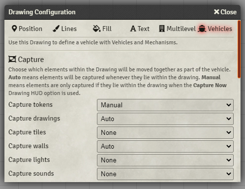

# Vehicles and Mechanisms module for Foundry VTT

This module for FoundryVTT introduces a way to control multiple scene elements (tokens, tiles, walls, and so on) as a single unit, so that they all move and rotate at once. This grouping of elements is referred to as a **vehicle**, but the concept is flexible and can be used for general automation, traps, or other mechanisms with moving parts.

Vehicles can be controlled directly, or remotely, using a special token assigned as a **controller**.

Vehicles are defined using Foundry's built in drawing tools. A new tab in the **Drawing Configuration** window for any rectangle, ellipse or polygon drawing is used to configure vehicle behaviour.

**Note: this module is currently somewhat experimental.** It should be reasonably solid, but there could be some rough edges. You can direct feedback to `grand#5298` on the Discord.

## Installation

You can install this module by searching for it in Foundry's built-in module browser, or with the following public URL:

```
https://raw.githubusercontent.com/grandseiken/foundryvtt-vehicles-and-mechanisms/master/module.json
```

This module depends on the [Multilevel Tokens](https://github.com/grandseiken/foundryvtt-multilevel-tokens) module. Version `1.2.0` of Multilevel Tokens is currently required. Please make sure you have the latest version of both modules installed, or you might run into problems.

Remember to enable the module in the **Manage Modules** menu after installation.

## Basics

TODO.

## Capturing

Vehicles work by **capturing** scene elements. When an element is captured, it will move and rotate with the vehicle. Note that a captured element can still be moved independently, or step off of the vehicle, but will be brought along with the vehicle's movement as long as it remains within the drawing defining the vehicle.



For each type of element (**tokens**, **drawings**, **tiles**, **walls**, **lights** and **sounds**), you can choose between three capture behaviours:

* **None** (the default) means that elements of this type will not be captured by the vehicle.
* **Auto** means that all elements of this type that lie within the drawing defining the vehicle will be captured whenever the vehicle moves.
* **Manual** means that elements of this type can be captured manually using the **Capture Now** button in the drawing HUD (availably by right-clicking on the drawing). This button only appears if the vehicle has been configured with at least one **Manual** capture setting. When the button is clicked, all elements of types set to be manually-captured that lie within the drawing will be captured. Manually captured elements can be released with the **Release All** button in the drawing HUD.

For example, you might use the **Auto** setting for tokens, so that any token that steps onto the vehicle is captured automatically. The drawback of the **Auto** setting is that it could result in unintentional captures. For other elements of the vehicle that should be fixed, the **Manual** setting makes more sense: for example, to create a vehicle that includes walls, you likely want to manually capture the relevant walls once to begin with, and them leave them alone. This way, the vehicle won't start dragging any other walls it encroaches along with it.

For most element types, only the centre-point of the element must lie within the bounds of the drawing in order for the element to be eligible for capturing. _Both_ endpoints of a wall must lie within the drawing for the wall to be captured.

## Capturing drawings

There are two particular reasons why you might want to capture drawings:
* If one vehicle captures a drawing that defines a second vehicle, the second vehicle and all the elements that _it_ captures will also be moved along with everything captured by the first when the first vehicle moves. This allows for vehicles-on-top-of-vehicles or other more complex mechanisms.
* A vehicle can capture a drawing configured with Multilevel Tokens. In theory, this should allow for things like multi-level vehicles.

## Additional capture options

* **Fix token orientation**: if this box is left unchecked, tokens captured by the vehicle will themselves rotate (i.e. their images will rotate) when the vehicle rotates. This might look odd if you use portrait-style tokens. You can check the box to 
* **Wall collision**: usually, vehicle movement ignores walls. If you check this box, tokens moving on a vehicle can be blocked by walls that are not part of the vehicle. Note that the vehicle itself is not blocked, so this will result in the vehicle sliding past underneath the blocked tokens.

## Controller tokens (advanced)

TODO.

The advantages of using controller tokens are:

* By granting players control of the controller token, they can be used to give your players control of a vehicle.
* A single controller token may be associated with multiple vehicles. This allows several vehicles to be controlled at once with a single input.
* The controller token need not be placed within the vehicle itself. This allows a vehicle to be controlled remotely, even from another scene.
* Moving the vehicle drawing always translates directly to movement of elements captured by the vehicle. On the other hand, the way in which a controller token's movement translates to movement of the vehicle can be customized in various different ways (see below).
* A vehicle's movement may cause a controller token to move, causing another vehicle to also move, and so on. I am sure somebody will find a way to devise elaborate contraptions.

As with moving the drawing directly, holding the Alt key allows you to reposition or rotate a controller token without also moving any vehicles it controls.

# Version history

* **0.1.0**:
  * First version.
